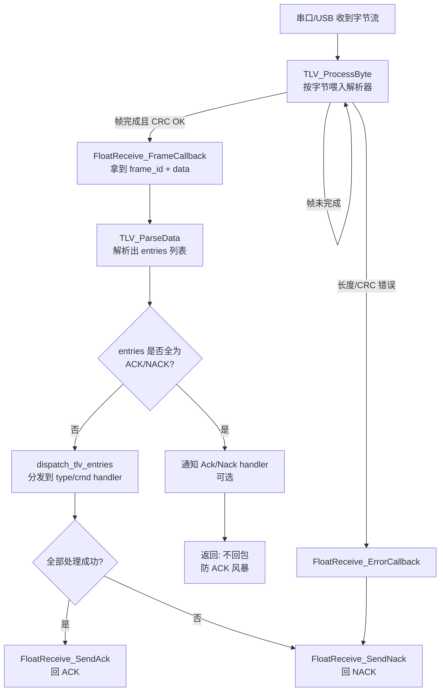
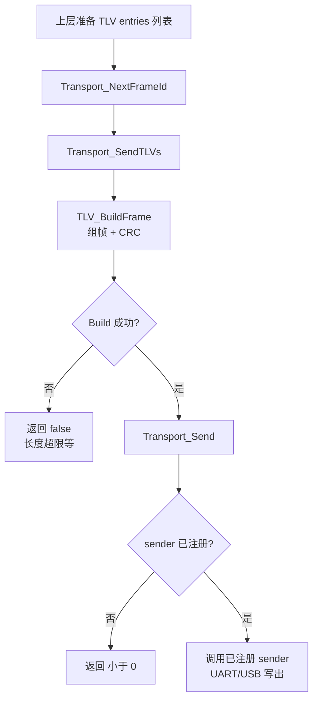

## 项目概览
TVLCOM 是一个简单可靠的 TLV（Type–Length–Value）双向通信协议实现，附带 Windows 下串口 Demo 程序。适用于 UART/USB 等字节流链路，支持自定义类型、CRC 校验、回调分发与 ACK/NACK 机制。

### 特性
- 支持 TLV 可变长载荷：整数、浮点、字符串、原始二进制
- CCITT CRC16 校验、长度检查
- 完整帧自动分发到类型/命令回调
- 成功回 ACK，失败回 NACK（不会形成 ACK 风暴）
- 传输层与解析层解耦，易于移植到 MCU（含 STM32 要点）

### 目录结构（核心）
- `src/SoftwareAnalysis/S_TLV_PROTOCOL.[h/c]` 协议核心：帧格式、TLV 构造/解析、CRC
- `src/SoftwareAnalysis/S_RECEIVE_PROTOCOL.[h/c]` 接收分发：注册回调、自动 ACK/NACK、错误处理
- `src/SoftwareAnalysis/S_TRANSPORT_PROTOCOL.[h/c]` 传输层：底层发送注册、统一发帧接口
- `src/Serial/` Windows PC 端串口实现（MCU 上无需）
- `src/main.c` Windows 示例程序（串口演示）
- `GLOBAL_CONFIG.h` 全局配置（如调试开关）

## 构建与运行（Windows + MinGW）
前置：已安装 CMake 与 MinGW-w64（GCC）。在 PowerShell 中执行：

```powershell
cmake -S . -B cmake-build-debug-mingw -G "MinGW Makefiles"
cmake --build cmake-build-debug-mingw --config Debug --target TVLCOM
.\cmake-build-debug-mingw\TVLCOM.exe
```

运行前请根据实际串口修改 `src/main.c` 中的串口号，例如：`serial_open("COM4", 115200)`。

程序启动后将：
- 注册传输层与接收分发层；
- 发送一帧演示数据（整数/字符串/浮点/电压/原始数据/命令/NACK 示例）；
- 可使用后台接收线程避免阻塞；
- 控制台按 Ctrl+C 退出。

注意：串口打开失败时程序会进入“dry 模式”（仍可运行但不会真正发送）。

## 常用开关（编译/运行时）
- 调试日志：`TLV_DEBUG_ENABLE`
  - 默认值在 `GLOBAL_CONFIG.h` 中控制；`src/main.c` 里也有兜底定义。
  - 置 1 可在控制台打印接收解析日志。
- 发送线程：`ENABLE_PERIODIC_SENDER`（位于 `src/main.c`，默认 0）
  - 置 1 后每 2 秒随机发送 1~3 个 TLV，模拟上位机/设备报文。
- 后台接收线程：`ENABLE_RX_THREAD`（位于 `src/main.c`，默认 1）
  - 置 1 在独立线程中 `serial_read` + `TLV_ProcessByte`；置 0 则在主线程阻塞轮询接收。

## 协议概览
帧格式：
```
[Header 2B: 0xF0 0x0F]
[Frame ID 1B]
[DataLen 1B]     // 后续 TLV 数据段总长度
[Data: TLV1 + TLV2 + ...]
[CRC16 2B]       // 对 FrameID + DataLen + Data 计算 (CCITT 0x1021, init 0xFFFF)
[Tail 2B: 0xE0 0x0D]
```
TLV 单元：`[Type 1B][Length 1B][Value N bytes]`
- 常用类型（可扩展）：
  - `TLV_TYPE_CONTROL_CMD (0x01)` 命令，`Value[0]` 为命令值
  - `TLV_TYPE_INTEGER (0x02)` 32 位整型（小端）
  - `TLV_TYPE_STRING  (0x03)` UTF-8 文本
  - `TLV_TYPE_ACK (0x08)` / `TLV_TYPE_NACK (0x09)`
- 数据段最大长度默认 `TLV_MAX_DATA_LENGTH = 240`（见 `S_TLV_PROTOCOL.h`）。

## API 速览
- 发送注册：`Transport_RegisterSender(tlv_interface_t ifc, transport_send_func_t fn)`
- 发送 TLV 帧：`Transport_SendTLVs(ifc, frame_id, entries, count)`；`frame_id` 建议用 `Transport_NextFrameId()`
- 解析推进：把每个接收字节喂给 `TLV_ProcessByte(parser, ch)`；常用 `FloatReceive_GetUARTParser()` 获取解析器
- 处理回调：
  - 类型回调 `FloatReceive_RegisterTLVHandler(type, handler)`
  - 命令回调 `FloatReceive_RegisterCmdHandler(cmd, handler)`
  - 全部 TLV 处理成功 → 自动回 ACK；失败或未处理 → 自动回 NACK

提示：回调中 `tlv_entry_t.value` 指向解析器内部缓存，仅在当前回调期间有效；如需保留请立即复制。

## 嵌入式/STM32 集成要点（简版）
- 实现底层发送函数并注册：在 HAL 环境中用 `HAL_UART_Transmit()`/DMA 封装 `transport_send_func_t`，再 `Transport_RegisterSender(TLV_INTERFACE_UART, fn)`。
- 接收侧在中断或 DMA+IDLE 中循环调用 `TLV_ProcessByte()`；
- 初始化：`FloatReceive_Init(TLV_INTERFACE_UART);`，按需注册类型/命令回调；
- ACK/NACK 由接收分发层自动发送；
- 按小端打包，若对端不同需统一约定。

## 协议处理流程框图

### 接收（RX）处理流程



### 发送（TX）处理流程



## 单元测试（不依赖真实串口）

工程内置了零依赖的最小单元测试：`tests/test_protocol.c`，通过 mock sender 捕获 ACK/NACK 并用字节流喂给解析器。

覆盖点：
- TLV handler 成功 => 自动 ACK
- 未知 TLV type => 自动 NACK
- 收到 ACK 帧 => 不回包（防 ACK 风暴）

在 Windows + MinGW 下运行（PowerShell）：

```powershell
cmake -S . -B cmake-build -G "MinGW Makefiles" -DTVLCOM_ENABLE_TESTS=ON -DTVLCOM_PLATFORM=WINDOWS -DCMAKE_BUILD_TYPE=Release
cmake --build cmake-build
ctest --test-dir cmake-build --output-on-failure
```

## 文档（更详细）
如果你想看更完整的协议细节、移植（MCU/HAL）与调试排错，请看 `docs/`：
- 文档索引：[`docs/README.md`](./docs/README.md)
- 协议详解：[`docs/PROTOCOL.md`](./docs/PROTOCOL.md)
- 移植到 MCU（HAL 接入指南）：[`docs/PORTING.md`](./docs/PORTING.md)
- 调试与问题定位：[`docs/DEBUGGING.md`](./docs/DEBUGGING.md)

> 建议阅读顺序：协议详解 → 调试定位 → MCU 移植。

## 许可证
请参考仓库根目录的 LICENSE；如未提供，默认保留所有权利。
